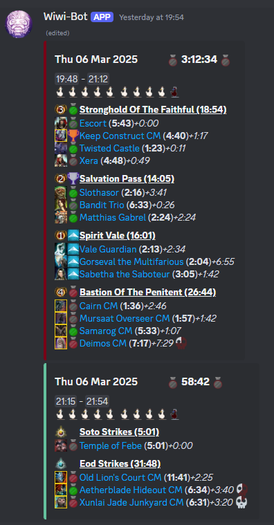
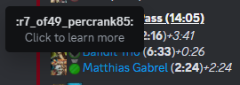
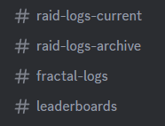

# Gw2 Log Manager
This log manager is specifically geared towards tracking clears within a raid static. It will upload logs to [dps.report](https://dps.report) and create a discord message using webhooks with the run times. 
It also compares the runs with previous results and shows how you did on the leaderboard.
For any questions or feature requests feel free to slide into the discord server
[Wiwi's Corner](https://discord.gg/C6sNvPq3dK).

# Features
It is a local tool that uses dps logs from arc-dps and uploads them to dps.report. The log manager will create a discord message for a raiding or fractal session. It will post new logs while raiding every time there is one available. Or just upload the full run afterwards.

Apart from uploading the logs to dps.report, they will be processed locally first using the https://github.com/baaron4/GW2-Elite-Insights-Parser.

### Static clears



(**5:43**) cleartime of the encounter\
_+1:17_ Time between the end of the previous kill run and the start of the current kill run. If its the first log in the session it will be 0:00, unless there is a fail log. \
 Throphies and medals indicate position on leaderboard, comparing the speed of that run with all historic runs.\
 Invalid medals mean that there were more pugs than allowed (check settings).\
 25th to 50th percentile. Slower than 50% of the runs, but faster than 75% of the runs.\
 5s faster than average, but not in top 3\
 Wipe, red indicates how much health left. More red = lower boss health. Hover to see remaining health percentage.\
\
Clicking the skull icon will also open the log of that run. Does sadly not work on phone.\
 Amount of core members in the run.\
 Amount of pugs in the run.\
**3:12:34** Total runtime of combined runs. Only shows when all* encounters have been successfully killed. For raids and strikes the whole week is checked. Fractals need to be cleared on the same day. For each day the total time between the first and last log is taken.\
_*Only selected encounters count, see the [setup guide](#selecting-encounters-for-total-clear-time)._\
 Emboldened runs will not count towards leaderboards.\
 When hovering medals it will show the rank and total encounters 
that were used in calculating the medal. Also it shows how much slower it was than the best run. 13_7s here means 13.7 seconds.


### Leaderboards
\
 Click the trophy to go to the dps report.\
 Hover the medal to see amount of logs available for that medal.\


### Progression runs

When working on a CM or LCM the progression can be tracked in a separete thread on discord. Below a message example for Cerus LCM. The message will be updated with each new log, so you can see logs during the run.

The link to dps.report is found by clicking the ★ (LCM) or ☆ (CM). Time left on the clock when breakbar phase starts is logged, to give indication if the run would have even be possible.

To indicate where breaks were taken, the delay is shown when more than 120s delay between two logs.

The top 3 logs are indicated with trophies. The title number (Day #11) indicates the day of progression.


# Installation

The log manager is built on the django framework with a local sqlite or (remote) postgresql database, only tested on Windows. All that is required is a local python environment to run the scripts. Below installation is done with pixi, feel free to use any other python distribution to your liking, however the installation steps will be different.

## Software
<!-- 1. <s>Download the latest [release](https://github.com/wiwihere/wiwi-bot/releases)<\s> and place it anywhere. Unpack the zip. -->
1. Download [install_gw2_discord_logs.cmd](https://github.com/wiwihere/wiwi-bot/blob/main/install_gw2_discord_logs.cmd) OR pull the repo with github desktop.
2. Run `install_gw2_discord_logs.cmd` twice. This will install Git, Pixi and the gw2_logs_archive software. 
3. Enable logging to file in [arcdps](https://www.deltaconnected.com/arcdps/), can be done in-game `alt+shift+t`.\


3. -- optional -- To later be able to update easily, install https://github.com/apps/desktop and use that to download this repo. 
4. -- optional -- Use the IDE of your choice if you need to debug errors or want a bit more control. I use [vs-code-insiders](https://code.visualstudio.com/insiders):\
    a. Install the python and jupyter extensions.\
    b. File -> Open Folder ->  select the folder with the unpacked zip from 1.\
    c. Open the file `wiwi-bot/gw2_logs_archive/scripts/import_dps_report.py`\
    d. On the bottom right click the python interpreter  and select the python env we installed at step 2; .\
    e. Run the code with `shift+enter` or by pressing  above the code blocks.

## Initial setup

A couple tokens and keys need to be set so the results can be posted to discord.

1. Rename `.env-example` to `.env`.
    - .env\DPS_REPORT_USERTOKEN -> place userToken from https://dps.report/getUserToken after = sign.
    - .env\CORE_MINIMUM_RAID -> [0 to 10] Minimum core members in run for leaderboard
    - .env\CORE_MINIMUM_FRACTAL -> [0 to 5] Minimum core members in run for leaderboard
    - .env\INCLUDE_NON_CORE_LOGS -> [True or False] When True non core runs are still posted on leaderboard, but they get a red background emote (e.g. )
    - .env\MEAN_OR_MEDIAN -> [mean or median] Choose what unranked runs are compared with, the median or mean of all runs.
    - .env\MEDALS_TYPE -> Choose which medals are used. options are ['original', 'percentile', 'newgame']

2. Rename `.env.prd-example` to `.env.prd`. This file is used for production environment and will be used when APP_ENV is set to PRD in the .env file. This file holds the database connection settings and webhook urls. For testing a similar .env.dev can be setup with a different database and webhooks.

2. In discord we have 4 channels running. The `raid-logs-current` channel is optional ([more info](#adding-channel-with-only-the-current-week)).
Create a webhook for each you want and copy the webhook URL into the env. Under the corresponding
`.env\WEBHOOK_BOT_CHANNEL_RAID`, `STRIKE` or `FRACTAL` variable.

    \
    Make sure to tick the option:\
    

    discord Server Setttings -> integrations -> Webhooks -> Copy Webhook URL

3. Within the leaderboards channel create threads for: `raids`, `strikes` and `fractals`.

- Get the thread id by right click -> copy link or  -> paste only the last 18 digit number in the .env.

4. Setup the database. Copy `data/db-empty.sqlite3` to `data/db.sqlite3`.

5. Add core members to the database, see [Add a core member](#add-a-core-member).

## Usage
For runs on the same day just run `bin\run_logs_today.cmd` from the file-explorer. This will upload only
raid, strike and fractal logs.
To filter the uploading for a specific instance run the respective .cmd (e.g. `run_logs_today_raid.cmd`)

To import history run `bin\run_logs_date.cmd` from the file-explorer. Then enter the date and the 
instance type. Leave empty to use `raid strike fractal`.\


#### Upload from url
To upload from a list on urls. Paste the urls in `bin\urls.txt` and run the cmd file `bin\upload_from_url.cmd`\


## Customization
A lot can be customized. Easiest way to make edits to the database is by firing up Django.

- Run `bin/django_runserver.cmd.`
- Open http://127.0.0.1:8000/admin/
- user: wiwi, pw: wiwi-bot


#### Add a core member:
Add members to the players list to have them appear as a core member. 

- Go to the Players page; http://127.0.0.1:8000/admin/gw2_logs/player/ and add a new player:\


#### Add new encounter
When parsing a log from an encounter that is not in the database yet, the script will throw
a warning and ignore it. If .env/DEBUG is set to True an error will be raised instead. \


The encounter will have to be added to the database if you want it to show up on discord.
- Add encounter to http://127.0.0.1:8000/admin/gw2_logs/encounter/
- Use the boss id from error message.


#### Removing logs
To remove logs or a clear you need to look at these three tables.
- http://127.0.0.1:8000/admin/gw2_logs/instancecleargroup/
- http://127.0.0.1:8000/admin/gw2_logs/instanceclear/
- http://127.0.0.1:8000/admin/gw2_logs/dpslog/


#### Showing non-cm encounters on leaderboard
We are not showing all enounters in the leaderboard because we are not interested in non-CM runs.
Which encounters are shown is configured in the LB and LB CM options per encounter.\
See http://127.0.0.1:8000/admin/gw2_logs/encounter/ to change the behaviour\


#### Selecting encounters for total clear time
Not all groups clear everything. It is possible to select the encounters you want to include in 
the total clear time. The total clear time will be displayed in the leaderboard and on
the top-right of the discord message.

Go to http://127.0.0.1:8000/admin/gw2_logs/encounter/. Change the column _use in instance_group_ to 
the desired group. For each encounter you want to add or remove.


#### Adding channel with only the current week
It is possible to create a separate channel that will only show the logs from the current week.
This can be useful if the raid-logs channel is getting very slow to load. Discord seems to load about 100 message
and there are quite a few emotes in each message.

The archive channels holds all logs and will always be updated. The current week channel will only show
the logs for the current week.

In the `.env` set the variable `WEBHOOK_BOT_CHANNEL_RAID_CURRENT_WEEK` and  `WEBHOOK_BOT_CHANNEL_STRIKE_CURRENT_WEEK`
to the webhook url of the channel. When raids and strikes are combined. Fill both with the same value.


#### Database connection to external server

To add a connection to a database server on or outside of the local machine, you can use a connection string.
We are running a postgresql server. Set these variables:
For a local sqlite database, only the DJANGO_DATABASE_NAME (path to db.sqlite3) and DJANGO_DATABASE_ENGINE (`django.db.backends.sqlite3`) are needed. Keep the restempty.

```
DJANGO_DATABASE_NAME=
DJANGO_DATABASE_ENGINE=
DJANGO_DATABASE_USER=
DJANGO_DATABASE_PASSWORD=
DJANGO_DATABASE_HOST=
DJANGO_DATABASE_PORT=
```

#### Setting up a progression run for a CM or LCM

When working on a CM or LCM the progression can be tracked in a separete thread on discord. To setup create the file `data\encounter_progression_config.json` and add the encounter with the following format:

```
"encounter_key": { <-- e.g. "decima_cm">
    "description": "Description of the run",
    "encounter_name": "Name of the encounter as in the database",
    "display_health_percentages": [70, 40, 10],
    "embed_colour": "16776960",
    "webhook_thread_id_from_dotenv": "webhook_bot_thread_decima_cm" <-- the variable name in the .env.prd file that holds the webhook thread id for this encounter>
}
```

Then run
`bin\run_progression_today.cmd` and select the encounter you want to track (e.g. decima_cm). The script will check for new logs and update the message in the thread accordingly.